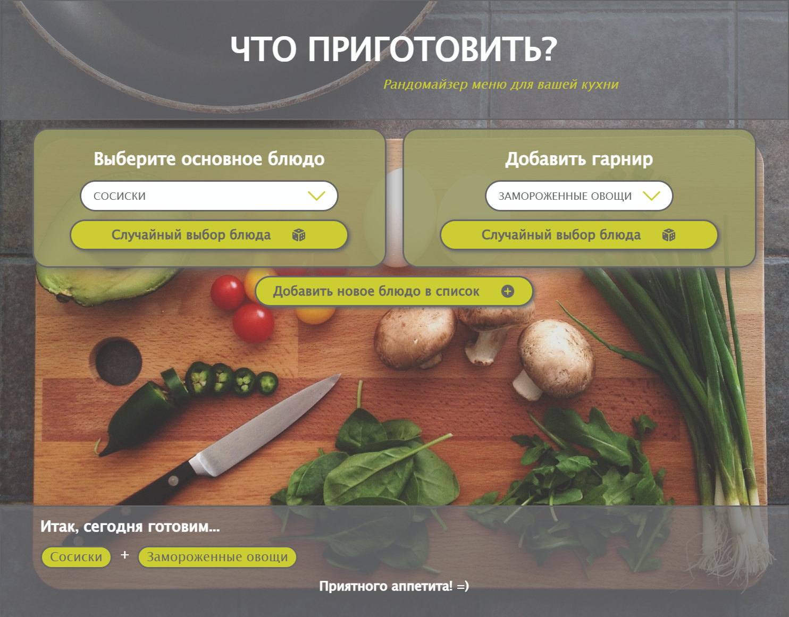

# cookingList

## Pet проект, в стадии активной разработки

_Вы когда-нибудь возвращались домой с работы, устало думая - ах, как бы проще придумать, что я приготовлю сегодня на ужин? В вашем арсенале много вкусных блюд, однако так сложно решить, что именно будет готовиться сегодня. Именно для решения этой боли и создано это приложение - оно компактно хранит список ваших любимых блюд и позволяет создавать их комбинации как в режиме случайного выбора, так и под вашим контролем_

Проект активно развивается и постоянно изменяется, его актуальную версию можно посмотреть по адресу https://talfril.github.io/cookingList/

## В планах на ближайшую разработку:

добавить возможность удаления блюда - позже, продумать архитектуру. Добавить отдельное меню редактирования?
добавить валидацию нового введенного блюда
добавить анимации рендеринга компонентов
добавить сброс выбранных блюд до начала
добавить таймаут случайного выбора и анимацию ожидания
подключить сторибук
заполнить метатеги
настроить фавиконки
